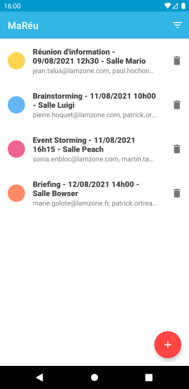
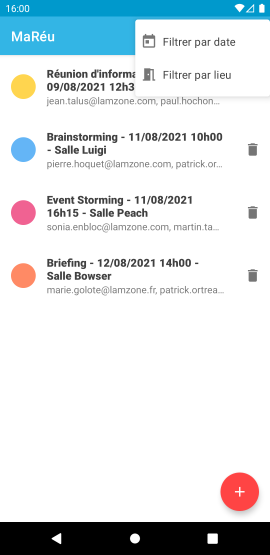
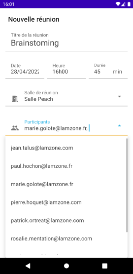
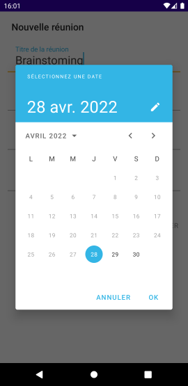

# MaRéu

Application du 4ème projet du parcours OpenClassrooms « Développeur d’application - Android » 

## Description

MaRéu est une application de gestion de réunion. Elle affiche une liste de réunions, filtrable par lieu et par date. On peut ajouter ou supprimer une réunion.

## Compétences mises en œuvre

- Codée en **Java**

- Architecture **MVC**

- RecyclerView

- DialogFragment

- MaterialDatePicker et MaterialTimePicker

- MultiAutoCompleteTextView

- Localisation en Français et en Anglais

## Aperçu

    